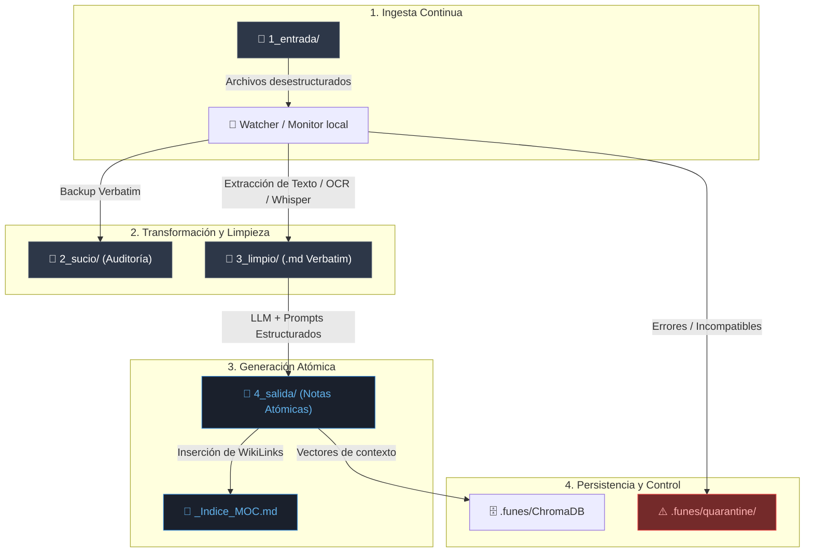
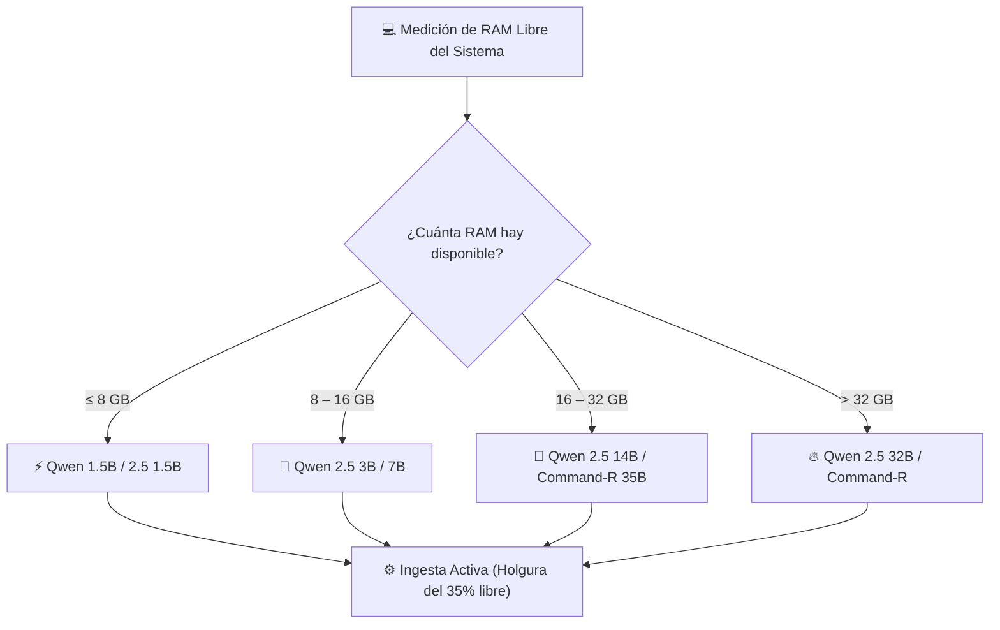
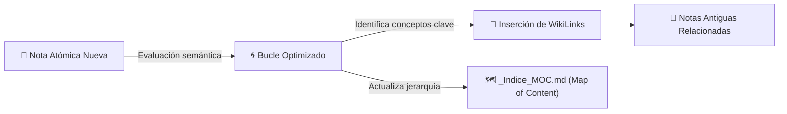

# 🧠 Funes: Infografía Explicativa del Sistema

> **"El tejedor local de conocimiento que transforma el caos de archivos en un Segundo Cerebro conectado en Obsidian."**

---

## 📐 1. Arquitectura General y Flujo ETL en 4 Etapas

Funes opera mediante un pipeline de extracción, transformación y carga (ETL) continuo e incremental de 4 fases que procesa archivos desestructurados en bruto y los convierte en notas atómicas interconectadas en **Obsidian**.



---

## ⚙️ 2. El Motor de Extracción Multiformato

Funes procesa automáticamente cualquier tipo de documento convirtiéndolo a texto limpio sin alterar los archivos originales.

| Categoría | Formatos Soportados | Tecnología de Extracción | Salida Resultante |
| :--- | :--- | :--- | :--- |
| **Documentos y Tablas** | `PDF`, `DOCX`, `XLSX`, `PPTX`, `CSV`, `HTML`, `MSG`, `TXT` | Parsers nativos + OpenPyXL + Docx | Markdown formateado con tablas limpios |
| **Académico / Científico** | `LaTeX (.tex)`, `TeXmacs (.tm)` | Extractor de ecuaciones | Preserva notación matemática `$math$` |
| **Audio y Notas de Voz** | `MP3`, `WAV`, `M4A`, `OGG`, `FLAC` | **Faster-Whisper** (Local) | Transcripción literal con marcas de tiempo |
| **Imágenes y Escaneos** | `PNG`, `JPG`, `TIFF`, `BMP` | **Tesseract OCR** (Local) | Texto reconocido sin depender de internet |

---

## 🎛️ 3. `RAM Governor`: IA Adaptativa según Hardware

Para evitar congelamientos del sistema, el **RAM Governor** monitoriza continuamente la memoria física y mantiene un margen de holgura libre del **35%**, seleccionando en tiempo real el modelo de **Ollama** óptimo.



---

## 🔄 4. Bucle de Grafo Optimizado (`OptimizadoGraphLoop`)

En segundo plano, un hilo autónomo re-evalúa de forma continua la red de notas para descubrir relaciones implícitas y mantener el conocimiento vivo.



> [!TIP]
> **Map of Content (MOC):** `_Indice_MOC.md` es el mapa temático auto-generado que clasifica automáticamente todas tus notas por temas, áreas de interés y cronología.

---

## 🛡️ 5. Tolerancia a Fallos y Alta Disponibilidad

> [!IMPORTANT]
> **Funes está diseñado para resistir las peculiaridades de los sistemas de archivos reales:**
> - **Filtro de archivos temporales**: Ignora automáticamente archivos borrador de Microsoft Office (`~$*`), descargas en curso (`.crdownload`, `.part`) y archivos bloqueados (`.tmp`, `.lock`).
> - **Aislamiento en Cuarentena**: Archivos dañados o no procesables se trasladan a `.funes/quarantine/` sin interrumpir la ingesta del resto del volumen.
> - **Resiliencia de Red**: Retrasos adaptativos para evitar errores por micro-cortes en carpetas compartidas por red (`SMB / NFS`).

---

## 📄 6. Anatomía de una Nota Atómica Generada (`4_salida/`)

Cada documento procesado se convierte en una nota limpia en Markdown lista para navegar en **Obsidian**:

```markdown
---
título: "Análisis de Ingesta Inteligente"
fecha: "2026-07-30"
autor: "Funes Core"
claves: [etl, obsidian, wikilinks, inteligencia-artificial]
fuentes: [3_limpio/documento_original.md]
---

# Análisis de Ingesta Inteligente

## Resumen Ejecutivo
- **¿Qué?**: Proceso de conversión estructurada de archivos.
- **¿Cuándo?**: Ingesta en tiempo real.
- **¿Quién?**: Funes ETL Engine.
- **¿Cómo?**: Extracción + LLM local + Grafo semántico.

## Contenido Principal
...

## Referencias Cruzadas
### Notas Relacionadas
- [[Nota_Sobre_RAM_Governor]]
- [[Documento_Graph_Optimizado]]
- [[Indice_MOC_General]]
```

---

## 🌟 Resumen de Puntos Fuertes

| Característica | Beneficio |
| :--- | :--- |
| **🔒 100% Local y Privado** | Sin APIs externas ni costes por token; tus datos no salen de tu equipo. |
| **🌐 Hiperconectado** | Enlaces automáticos `[[WikiLinks]]` para explorar tu información visualmente en el grafo de Obsidian. |
| **⚡ 1-Clic Launch** | Lanzadores automáticos para macOS (`instalar_funes.command`) y Windows (`instalar_funes.bat`). |
| **🎨 Interfaz Consola Vintage** | Consola de control con estética gráfica *Watergate Press* para monitorizar el proceso con estilo. |
